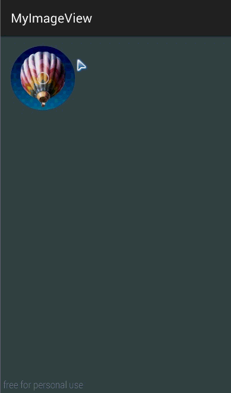

##先上效果图
  
**图片录制效果不好，实际运行很流畅的。**

## 使用方法
其实就是两个图片叠放在一起然后慢慢设置前面的图片变成透明色

1.将**CircleImageView.java**  , **LazyImageView.java** ,还有 **layout** 文件夹中的**lazyimageview.xml** 三个文件拷到项目中。

2.在要显示该View的布局文件中加入

>` <com.example.myimageview.LazyImageView
          android:layout_width="100dp"
          android:layout_height="100dp"
           android:id="@+id/image"
         />
         `
// 大小id啥的和普通View一样设置。

2.首先调用**LazyImageView**的 **setImages** 方法

>**public void setImages(int frontId, int backId)**  

>  frontid: 前面需要慢慢消失的图片的资源id  (一般是黑色的图片).

>backid: 后面需要显示的图片的资源id.

3.想要效果显示的时候调用**LazyImageView**的 **startAnimation()** 方法

----------
MainActivity中是Demo大家可以直接运行观看效果
-----------------------------------------------------
